# Instructions 

Authors are kindly asked to prepare one presentation file fulfilling both needs, the introductory 2-minutes-madness as well as the following intensive viewing and discussions. Please include the summary of your work in the first two slides followed by an unlimited number of slides going more into detail. The touch screens have a size of 42". The operating system is Windows 7 and they have internet access. Although the screens are in the 16:9 widescreen format, we recommend producing Power Point or PDF presentations in the classic 4:3 format. The extra space is used for the branding of the contribution as well as the navigation. The touch screens show three buttons allowing you to move forwards and backwards in the presentation as well as to access the table of contents (PICO programme) of that particular session. Please note that Prezi is not supported.

PICO is short, precise, and scientific. PICO is bringing the advantages of both, oral and poster, together into an innovative type of presentation which opens the opportunity to be interactive. Every PICO author presents first his/her work orally. But afterwards, all session attendees have enough time to watch the presentation again, to hold discussions with the author and colleagues, and to network.

A PICO presentation might be a Power Point one, a movie, an animation, or simply a PDF showing your research on a display. A PICO session takes place at the PICO spot which is a combination of an audience sitting in front of a screen together with a number of touch screen displays (PICO screens). The PICO session starts with a 2-minutes-madness, where all authors present the essence of their work in 2 minutes each. Thereby, time is reserved for one PICO presentation to provide a 10-minutes-introduction. Afterwards, the audience is using the PICO screens spread in the PICO spot to view again their PICO presentation(s) of interest. Authors are standing next to their scheduled screen to show their PICO presentation. A PICO presentation should be composed in a way to fulfil both requirements in one file, the 2 minute overview as well as the extensive viewing afterwards. To give you an idea how your PICO could look like please see the examples from the past conferences below:

# Abstract

Multiple people creating data in the field poses a hard technical problem: our “web 2.0” environment presumes constant connectivity, data “authority” held by centralised servers, and sees mobile devices as tools for presentation rather than tools for origination. A particular design challenge is the remoteness of the sampling locations, hundreds of kilometres away from network access. The alternative, however, is hand collection with a lengthy, error prone, and expensive digitisation process. 

This poster will present a field-tested[^footnote1] open-source solution to field data recording. This solution, originally created by a community of archaeologists, needed to accommodate diverse recording methodologies. The community could not agree on standard vocabularies, workflows, attributes, or methodologies, but most agreed that “recording data in the field’’ was a desireable app to have. As a result, the app is generalised for field data collection; not only can it record a range of data types, but it is deeply customisable. 

The NeCTAR funded FAIMS Project, therefore, created an app which allows for arbitrary data collection in the field[^footnote2]. In order to accomplish this ambitious goal, FAIMS relied heavily on OSS projects including: spatialite and gdal (for GIS support), sqlite (for a lightweight key-attribute-value datastore), Javarosa and Beanshell (for UI and scripting), and the entire linux stack plus ruby for a server. 

Only by standing on the shoulders of giants, FAIMS was able to make a flexible and highly generalisable field data collection system that CSIRO geoscientists were able to customise to suit most of their completely unanticipated needs[^footnote3]. While single-task apps (i.e. those commissioned by structural geologists to take strikes and dips) will excel in their domains, other geoscientists (palaeoecologists, palaeontologists, anyone taking samples), likely cannot afford to commission domain- and methodology- specific recording tools for their custom recording needs. FAIMS shows the utility of OSS software development and provides geoscientists a way forward for edge-case field data collection. Moreover, as the data is completely open and exports are scriptable, federation with other data formats is both encouraged and possible. 

This poster will describe the internal architecture of the FAIMS app, show how it was used by CSIRO in the field, and display a graph of its OSS heritage. The app is available from Google Play, the recording module can be found at https://github.com/FAIMS/CSIRO-Water-Samples and the exporter we used can be found at https://github.com/FAIMS/shapefileExport. You can make your own data-collection modules for free via the user to developer documentation at https://www.fedarch.org/support/2.

# Title Slide

Intent of slide: captioned visual narrative. This slide can be used to describe the complete workflow of module history, generation, and use

Grid of pictures: 

## Cell 1
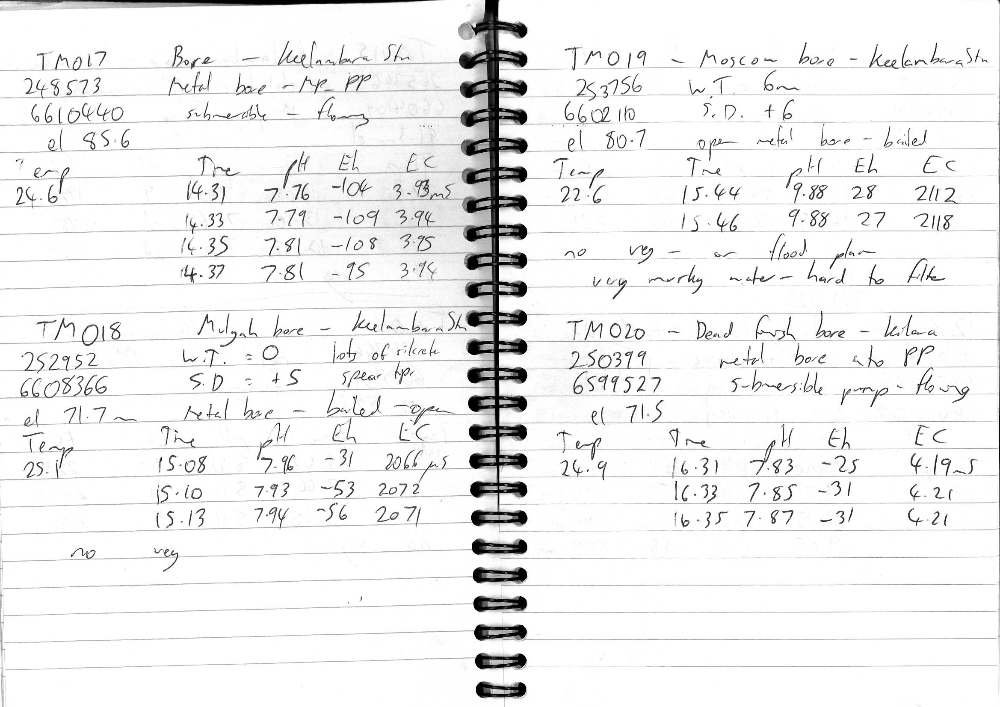

Caption: Geosampling data was initially collected via notebook.

## Cell 2

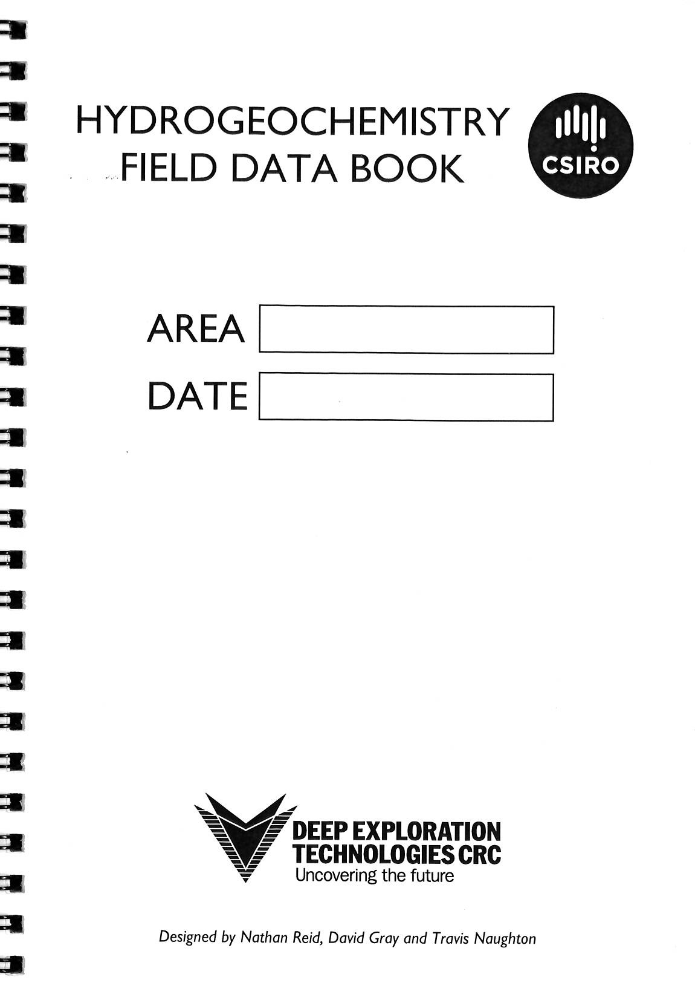 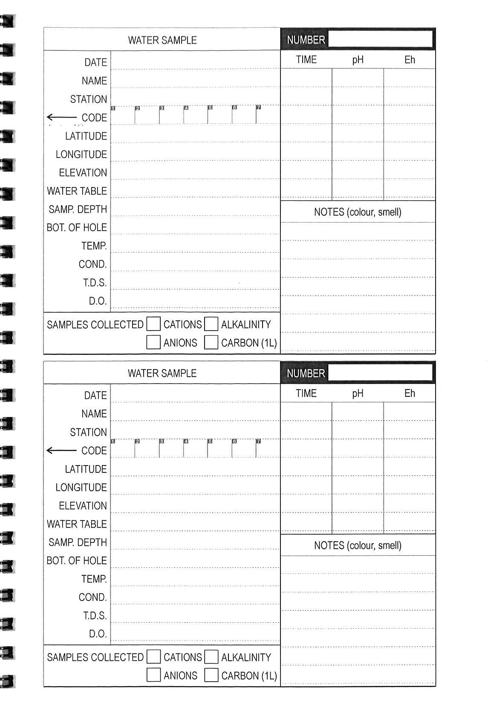 
Combined image caption: CSIRO Researchers then moved to pre-printed field notebooks for more accurate data entry. 

## Cell 3
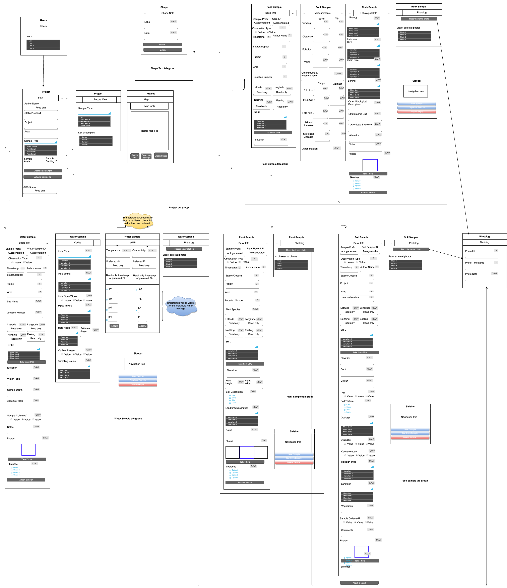
Caption: Imported into FAIMS Mobile. CSIRO workflow modeled in the generalised field recording app. Once approved, this workflow was implemented.

## Cell 4

Data Schema | Logic | UI Schema |
----------- | ----- | --------- | 
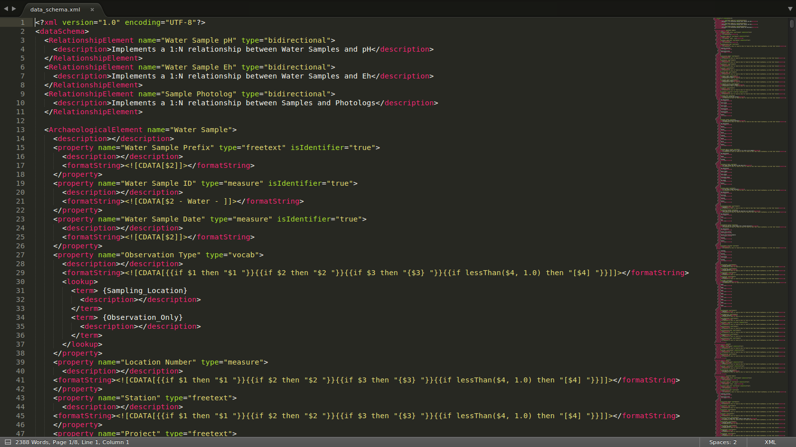 | 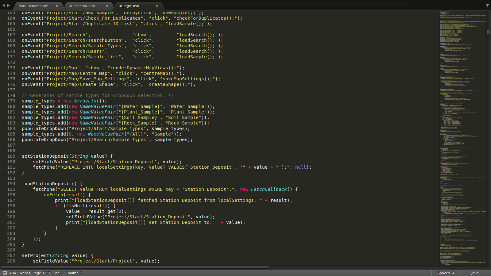 | 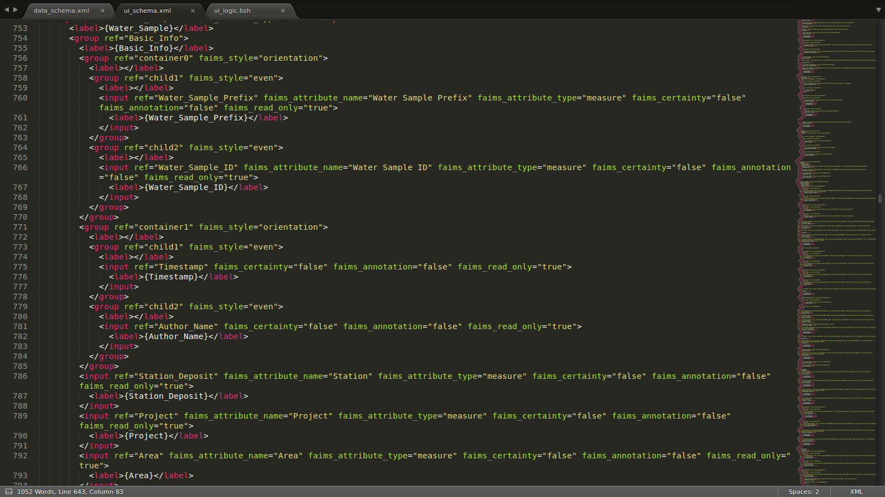 | 

 Caption: Available at https://github.com/FAIMS/CSIRO-Geochemistry-Sampling. These are the primary files which implement a scriptable model (data schema) | view (ui schema) | and controller (ui logic) field data recording implementation. By scripting a field recording workflow, the app itself can function on supporting field recording in network-degraded environments, and individual "modules" (functioning sets of these scripts) can focus on implementing highly specific and customised workflows. | 

## Cell 5

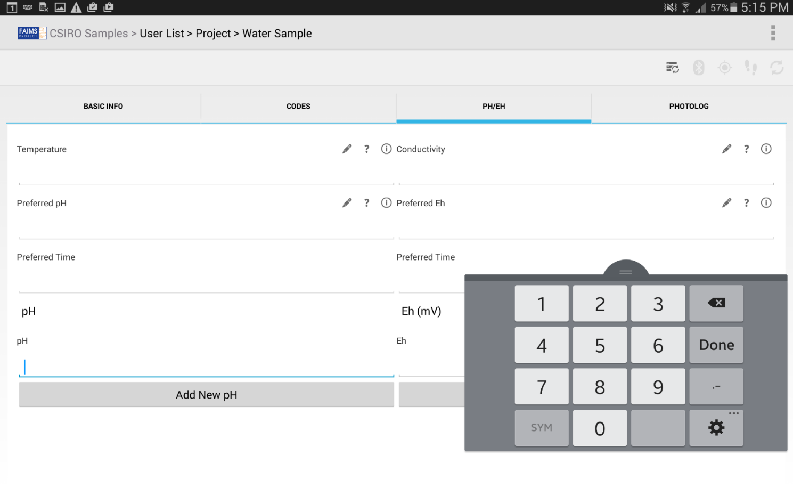 | 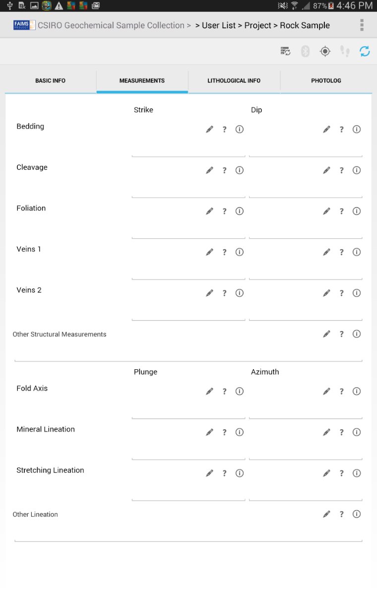 | 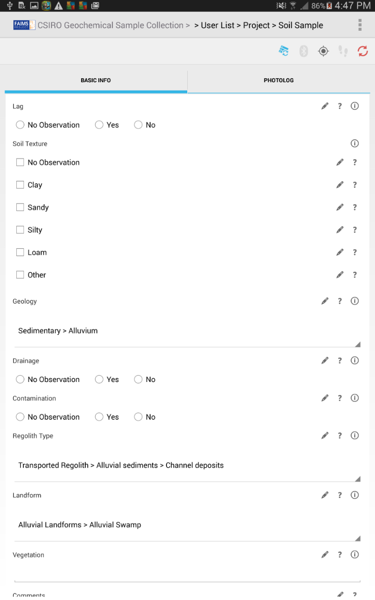 
----------- | -------- | --------- 

Caption: After extensive testing, an app was deployed. These are three screens, designated by the wireframe and scripted by the files before.

## Cell 6

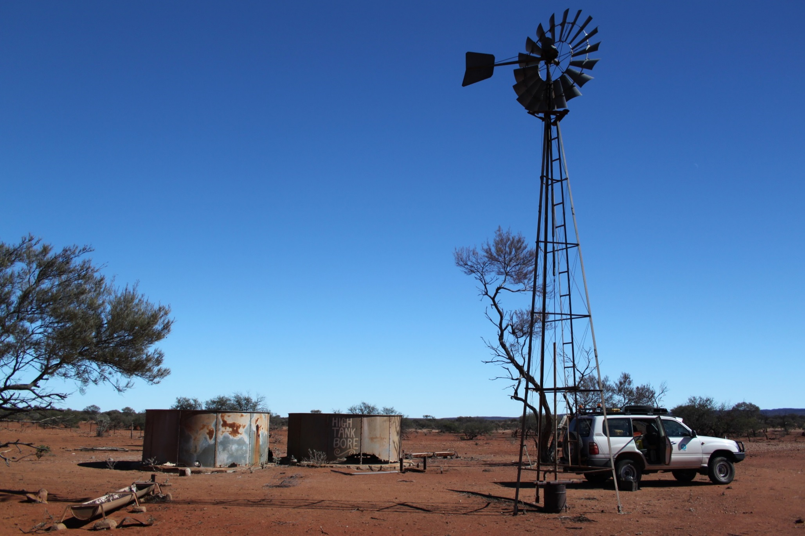
Caption: Data was collected on multiple tablets in the field

## Cell 7
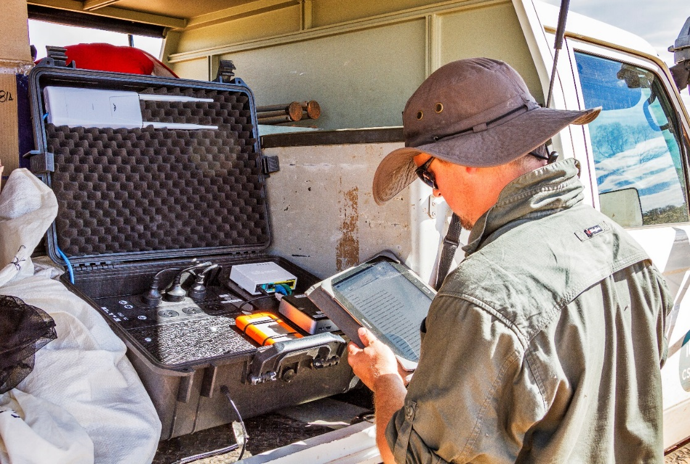 
Caption: FAIMS is designed to work completely offline, allowing asynchronous work on multiple tablets with eventual sync. The server, here, was built into a portable UPS in the truck.

## Cell 8
 | 
----------------------|------------------------------

Caption: After return to base, data exported (via customisable exporter) into shapefiles, a sqlite database, and CSVs. All pictures are renamed to the record they belong to and tagged with their record's metadata. This exporter (https://github.com/FAIMS/shapefileExport) is also completely customisable, up to and including running arbitrary linux programs. This one uses imagemagick and mogrify to properly export photos as well as spatialite-tool to export shapefiles. 

## Bottom Discussion

FAIMS Mobile is a FOSS Software platform (comprising an android client and ruby server on ubuntu) funded by the Australian Research Council designed to provide a means of collecting rich, geospatial, and multi-media field data on multiple tablets with no network connectivity in the middle of nowhere. While originally intended to support archaeologists, FAIMS Mobile provided a sufficiently general field recording framework to allow for geochemical and biological sampling by multiple teams of CSIRO researchers.

Code for this module is available at: https://github.com/FAIMS/CSIRO-Geochemistry-Sampling. The module can be explored by downloading FAIMS from google play and downloading the *CSIRO Geochemical Sample Collection - Sydney Maps* module from the demo server. A getting started guide is available at: http://faims.edu.au

Paper notes: 

# Detail Slide

## Internal Infrastructure

The fundamental innovation of FAIMS Mobile is the domain-key normal form append only datastore. Each record is identified by two naturally-unique identifiers: the user and the time of creation. Beyond that, every action is timestamped to allow for full histories and audit trails. Because every record and every action is timestamped and unique to a user, we can combine different versions of the database (i.e. those created on multiple devices over a week's trek through the Australian Outback) without any risk of clobbering edits or data. The most recent activity is "true" and instances where multiple users edited the same data at the same time are flagged for human review.

### DKNF Design

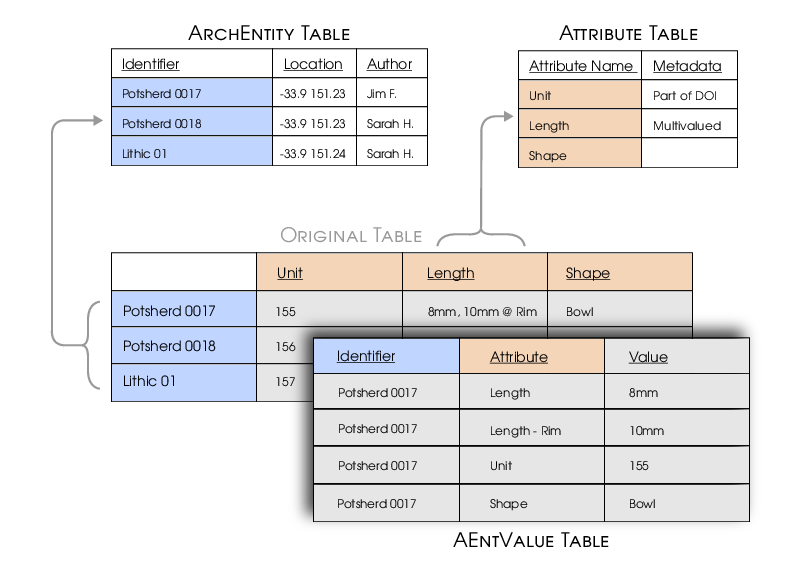 (Image by Geoff Matheson).

Records are defined in 3 logical tables. "Rows" are defined in the ArchEntity table, which also holds cruical GIS data. "Columns" are defined by the attribute and Ideal Entity tables. The Attribute table defines what attributes are possible, their names, and their list/export formats. The Ideal Entity table defines which attributes belong to which entity. By defining these tables in DML (data *manipulation* language) rather than DDL (Data *Definition* Language), the structure of the database remains consistent. This consistent structure allows for significant query reuse and allows us to dynamically script the fields of a workflow *after* all the fundamental data interactions of the app have been rewritten. 

Each attribute has four sub-attributes reflecting the needs of field data recording and can be multivalued if multiple rows *share* a timestamp. An attribute can comprise a set of: 
* a constrained vocabulary (how we implement dropdowns, checkboxes, and radio buttons); 
* a unconstrained measurement; 
* an annotation (to represent a way of scribbling in the margins without contaminating the data); and 
* a certainty (to reflect scribbling question marks or to otherwise rate physical uncertainty of the data reliability). 

By combining these in a single "measurement." Highly nuanced but *machine readable* data can be recorded in such a way as to fit the needs of the recording workflow.

### Append only design

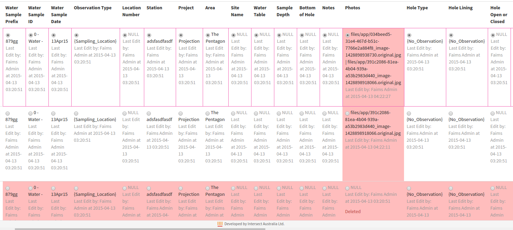

This domain-key structure is also necessary to support the append only design. As each "event" (insertion, updates, "deletion") occupies its own row, we use GROUP BY and HAVING max(timestamp) to emit the latest versions of each attribute. Event uniqueness is guaranteed by UUID (user creation + time of creation due to the length limits of integers as primary keys in Sqlite), acting userid, and time of event. Therefore, by virtue of the need of having "eventually consistent" data stores, we also have a complete action log for every record: it shows when each attribute was edited and by whom. This allows granular control and review of records, as individual attributes can be "rolled back" to a more authoritative/correct state by users on the server. 

The append-only design also protects against data-loss, as "deletions" are merely a flag on the record which hides it from normal view. Thus, this database is designed to preserve user actions at all costs, allowing differences in datastores to be sent to the server and thereby distributed to all devices. This also has the virtue, so long as devices sync relatively often, of creating a complete backup of the datastore on every device, further armouring the database against mischance.

## OSS Heritage

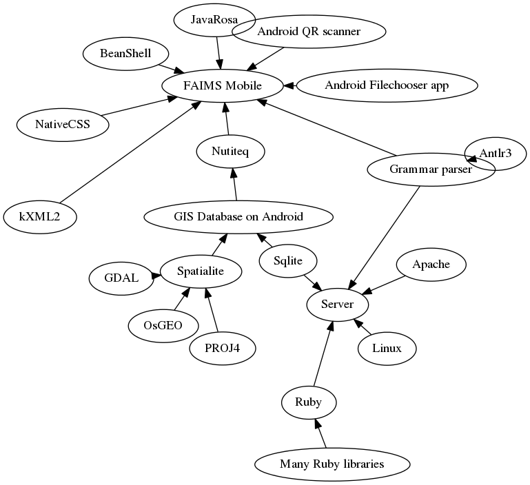

The FAIMS Mobile app stands on the shoulders of giants. The only way an app this complex would be possible would be via the contributions of many open source projects -- which is one of the primary reasons why our own work is released under the GPLv3. Crucial technologies include: 

* JavaRosa which allows us to parse XML into native android widgets, allowing us to avoid the overheads of html webviews for every single dynamic component. 
* NativeCSS which allows us to include some stylings for elements, defined at module load, rather than at compile;
* BeanShell which allows us to dynamically include a java-like scripting language, to allow for runtime logic changes.
* Antlr3 which allows for highly sophisticated parsing of strings, allowing for highly customisable record identifiers;
* Spatialite which allows GIS operations inside the database.
* Sqlite which is a supremely stable single-user database, which is perfect for offline operation
* Ruby, Apache, Linux which allows us to write a sophisticated server running on a completely open source stack.

Choices of the fundamental libraries were made in 2012, when the project was commissioned as part of NeCTAR (National eResearch Collaboration Tools and Resources project) eResearch tools initiative and the libraries remain solid (if slower than some newer iterations) for the next few years to come. 

# CSIRO Workflow

# Module Details

# Faims internal architecture

# OSS Heritage graph

